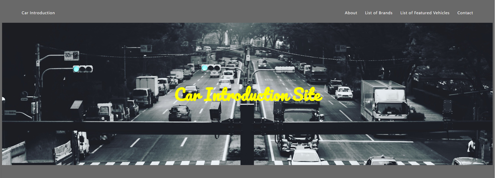

# 自動車紹介サイト

このサイトは, 中古車や新車の情報をユーザーに提供するための**自動車紹介サイト**です. 車の詳細情報を表示・登録・編集・削除できるほか, お気に入り登録や車の比較機能も提供予定です.

---

## 主な機能

- 車の登録
- 車一覧の表示（画像・メーカー・価格など）
- 車の詳細ページ
- お問い合わせフォーム
- 車の削除機能
- 編集機能
- お気に入り登録
- 車の比較機能

---

## 使用技術

- フロントエンド: **HTML / CSS / JavaScript**
- バックエンド: **PHP**
- データベース: **phpMyAdmin**
- フレームワーク: **未使用**

---

## ディレクトリ構成

<pre><code>
car-site/
├── php/
│     └── Dockerfile
├── public/                               # 公開用ディレクトリ
│     ├── index.php                       # トップページ
│     ├── update_car.php                  # 車情報更新のページ
│     ├── favorite_car.php
│     ├── unfavorite_car.php
│     ├── compare_car/
│     │     ├── compare_car.php
│     │     ├── compare_list_car.php      # 車比較ページ
│     │     └── remove_compare_car.php
│     ├── assets/                         # CSS
│     │     ├── main.css
│     │     └── compare_car.css
│     ├── img/
│     │     ├── car.jpg
│     │     └── car-speed.jpg
│     └── uploads/                        # 車の画像保存ディレクトリ
├── src/                                  # PHPビジネスロジック・操作処理
│     ├── insert_car.php                  # 車の登録処理
│     ├── delete_car.php                  # 車の削除処理
│     ├── session_values.php
│     └── db_connect.php                  # DB接続関数など
├── docker-compose.yml
└── README.md                             # プロジェクト説明ファイル
</code></pre>

---

## セットアップ手順

**１．リポジトリをクローン**
<pre><code>
git clone https://github.com/your-username/car-site.git
cd car-site
</code></pre>

**２．開発環境の準備**  
*Docker + docker-compose*
- Docker Desktop をインストール
- 以下のコマンドで環境を構築・起動
<pre><code>
docker-compose up -d
</code></pre>
- phpMyAdmin（DB管理画面）にアクセス：http://localhost:8083  
　ログイン情報：docker-compose.ymlに記載

**３．動作確認**
- ブラウザで次のURLにアクセスして表示確認：http://localhost:8082

**✅ 注意事項**
- uploads/ディレクトリには書き込み権限が必要です.

---

## ページ一覧

- `/index.php`           ：トップページ（一覧表示）
- `/favorite_car.php`    ：お気に入り追加処理
- `/compare_list_car.php`：比較リスト表示

---

## スクリーンショット

トップページ

比較ページ

ajisohjohjoahjoa